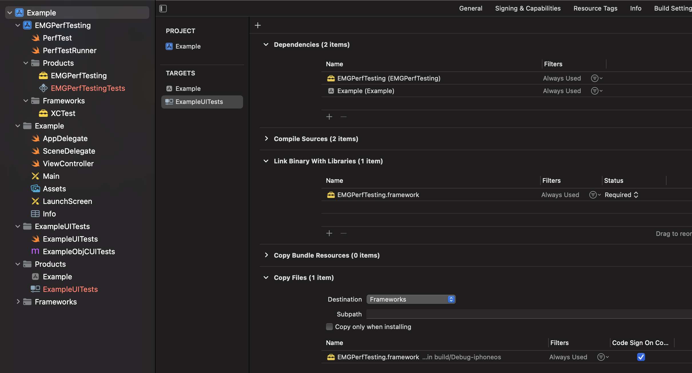

# Integration

There are multiple ways to integrate the EMGPerfTesting framework in a UI test bundle.

## By copy-pasting

This framework is quite small, so the easiest way to include it is to just copy-paste the two files that it consists of, PerfTestRunner.swift and PerfTest.swift, into the test bundle.

## By importing it manually

- Add EMGPerfTesting.xcodeproj as a child Xcode project of the project that contains the UI test bundle target
- Select the project that contains the UI test bundle target in the left-hand pane, then select the UI test bundle target, then go to the "Build Phases" tab
- Find EMGPerfTesting.framework in the left-hand pane in the Products group and add it to the "Dependencies" phase
- Add EMGPerfTesting.framework to the "Link Binary With Libraries" phase
- Create a new "Copy Files" phase, set its Destination to "Frameworks" and add EMGPerfTesting.framework to it. Then check the "Code Sign on ..." checkbox.

At the end, it should look approximately like it does in Example/Example.xcworkspace:

# Network Swizzling

Our test infrastructure depends on swizzling your application's network request/response logic to cache requests between test iterations. We've included sample code that roughly mimicks how our caching behavior works.
